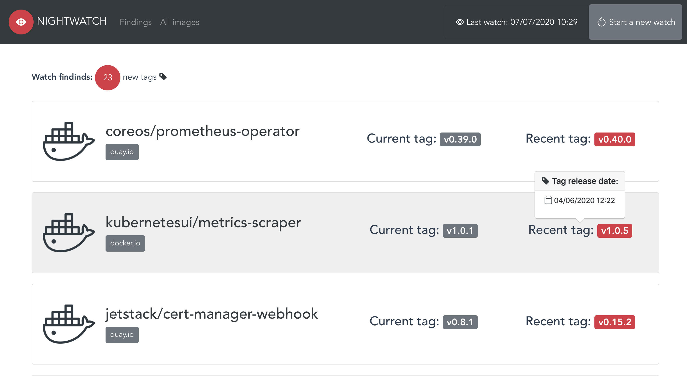

## About

**NightWatch** is a tool to monitor docker images deployed in a kubernetes cluster and track for new tags released in the registry.




An all-in-one [docker image](https://hub.docker.com/r/edevouge/nightwatch) is released including this components:
- `Daemon`: is the scheduled job that watches every hour: in the kubernetes cluster for images and in the registry for new tags.
- `API`: is an http endpoint exposing both: daemon lifecycle related actions and a REST CRUD api. A swagger doc is also available (route: `/api/v1/`)
- `Metrics`: exposes prometheus metrics at [openmetrics](https://openmetrics.io/) format (route: `/metrics`)
- `WebUI`: is a simple web console (route: `/`)

For now, only `docker.io` and `quay.io` registries are supported.


## Getting started

The simplest way to start is to chose the *in-cluster deployment strategy*:

1. Clone this repo:
    ```bash
    git clone git@github.com:edevouge/nightwatch.git
    ```
2. Edit the example of [kubernetes yaml manifests](./kubernetes) to match your environnement requirements
3. Apply manifests to your kubernetes cluster:
    ```bash
    kubectl apply -f ./nightwatch/kubernetes/
    ```
4. Bind the kubernetes service port to your localhost:
    ```bash
    kubectl port-forward -n nightwatch svc/nightwatch 8000:80
    ```
5. Access the service:
    - Webui: [http://localhost:8000/](http://localhost:8000/)
    - API doc: [http://localhost:8000/api/v1](http://localhost:8000/api/v1/)
    - Metrics: [http://localhost:8000/metrics](http://localhost:8000/metrics)


## Filter tags

As tag names are free text fields in most docker compatible registries, it could be useful to ignore some tags containing strings like: `latest`, `master`, `.*ubuntu`, `.*amd`, etc.

NightWatch implements powerful filters to select eligible tags matching a regular expression. These filters could be `global` or scoped at `registry` or `repository` levels.

Default filters could be found [here](./conf/tag-filters.json) and could be extended using a `configmap` like [this one](./kubernetes/configmap.yaml).
